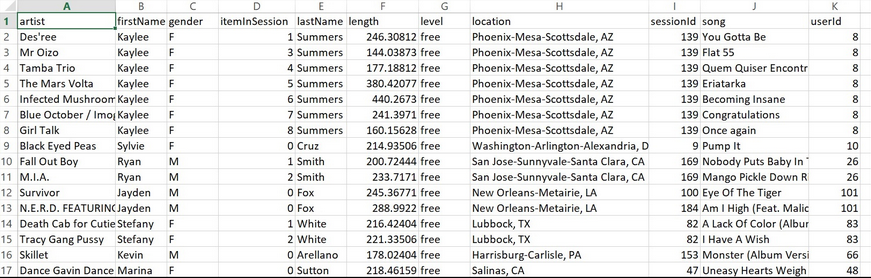

# Project-Data-Modeling-with-Apache-Cassandra

## Description

As a data engineer I am doing an assignment for the startup Sparkify. Indeed, Sparkify wants to have a precise idea about its music data in order to propose in the future a better music streaming app. To carry out this project first i had to create an Apache Cassandra database which can create queries on song play data. Then via an ETL pipeline i transfered data from a set of CSV files within a directory to create a streamlined CSV file to model and insert data into Apache Cassandra table.

## How to run 

1) Run Project_1B_ Project_Template.ipynb

## An explanation of the files in the repository

*event_data :* directory of CSV files partitioned by date

*Project_1B_ Project_Template.ipynb :* notebook where i modeled my NoSQL database and built ETL pipeline

The image below is a screenshot of what the denormalized data should appear like in the event_datafile_new.csv after the code above is run:

   
    
